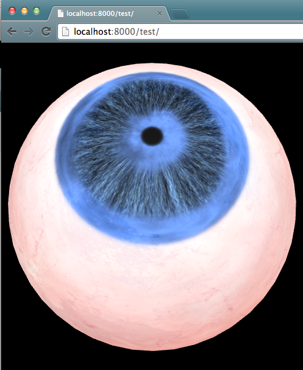
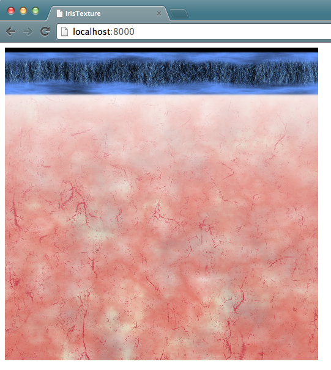

# Fully procedural GLSL eyeball shader

W.I.P. fully procedural GLSL eyeball shader.

## Components

* Iris
* Sclera

## Usage

To run WebGL demo, launch HTTP server locally, then open `localhost:8000`

    # example
    $ python3 -m http.server
    # open localhost:8000 with WebGL ready browser

Show generated eyeball texture in long-lat coordinate.

`localhost:8000/test/` will show texture mapped eyeball.

## Copyrights

* GLSL shader developed by https://github.com/FMS-Cat
* Cubemap from http://wgld.org/d/webgl/w044.html
